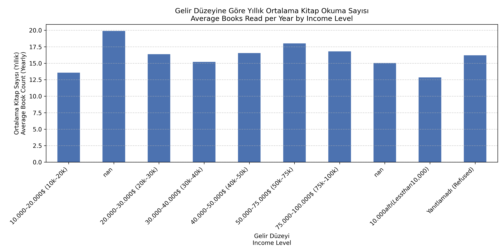

# 📚 Kitap Okuma Alışkanlıkları Analizi | Book Reading Habits Analysis


## 🔍 Proje Hakkında | About the Project

Bu proje, bireylerin kitap okuma alışkanlıklarını demografik faktörlere göre incelemeyi amaçlamaktadır. Kullanılan veri seti, yaş, cinsiyet, eğitim, medeni durum, gelir ve çalışma durumu gibi değişkenlerle desteklenen kitap okuma sıklığına dair bilgiler içermektedir. Proje kapsamında:

- Veri temizleme ve dönüştürme işlemleri yapılmıştır.
- Eksik veriler uygun stratejilerle doldurulmuştur.
- Demografik gruplara göre yıllık kitap okuma ortalamaları hesaplanmıştır.
- Kitap format tercihleri analiz edilmiştir.
- Kitap okumayan bireylerin profili çıkarılmıştır.
- Görsel analizler ve kelime bulutu ile desteklenmiştir.

---

This project explores how book reading habits vary across demographic segments using a survey-based dataset. It covers a full data analysis pipeline:

- Data cleaning and preprocessing
- Imputation of missing values
- Aggregated insights on reading behavior by demographics
- Visualization of preferences by book format
- Profile analysis of non-readers
- Word cloud representation of the last books read

---

## 🧰 Kullanılan Teknolojiler | Technologies Used

- 🐍 Python (Pandas, Matplotlib, Seaborn, WordCloud)
- 📒 Jupyter Notebook
- 🧠 Exploratory Data Analysis (EDA)
- 🖥️ Visual Studio Code
- 🌐 Git & GitHub

---

## 📁 Klasör Yapısı | Project Structure

read-patterns/
├── data/
│ └── cleaned_reading_data.csv
├── chart/
│ ├── average_books_by_gender.png
│ ├── book_format_preferences_by_education.png
│ ├── average_books_by_income.png
│ ├── non_readers_profile_final_cleaned.png
│ └── last_books_wordcloud.png
├── notebooks/
│ ├── 01_data_cleaning_and_eda.ipynb
│ └── 02_exploratory_data_analysis.ipynb
├── README.md
└── requirements.txt

---

## 📊 Örnek Görselleştirmeler | Sample Visualizations

### 📌 Cinsiyete Göre Yıllık Ortalama Kitap Sayısı  
📌 **Average Books Read per Year by Gender**  


---

### 📌 Eğitim Durumuna Göre Kitap Tercihi  
📌 **Book Format Preferences by Education Level**  


---

### 📌 Gelir Düzeyine Göre Yıllık Okuma Sayısı  
📌 **Average Books Read per Year by Income Level**  


---

### 📌 Kitap Okumayanların Profili  
📌 **Profile of Non-Readers**  


---

### ☁️ Son Okunan Kitaplardan Kelime Bulutu  
📌 **Word Cloud of Last Books Read**  


---

## 🧠 Elde Edilen Bazı İçgörüler | Key Insights

- Kadın bireyler erkeklere kıyasla yılda daha fazla kitap okumaktadır.
- Eğitim düzeyi arttıkça e-kitap ve sesli kitap tercih oranları artmaktadır.
- Orta ve üst gelir grupları daha fazla kitap okumaktadır.
- Kitap okumayan bireyler genellikle erkek, tam zamanlı çalışan, daha düşük eğitim seviyesine sahip ve ileri yaşlardadır.

---

## 🚀 Kurulum ve Kullanım | Setup & Usage

### 🔄 Reposityoyu Klonlayın | Clone the Repository

```bash
git clone https://github.com/kullaniciadi/read-patterns.git
cd read-patterns
🐍 Sanal Ortam Oluşturun (Opsiyonel) | Create Virtual Environment (Optional)
bash
Kopyala
Düzenle
python -m venv .venv
source .venv/bin/activate   # macOS/Linux
.venv\Scripts\activate      # Windows
📦 Gerekli Paketleri Yükleyin | Install Required Packages
bash
Kopyala
Düzenle
pip install -r requirements.txt
📓 Jupyter Notebook'u Başlatın | Start Jupyter Notebook
bash
Kopyala
Düzenle
jupyter notebook
notebooks/01_data_cleaning_and_eda.ipynb ve 02_exploratory_data_analysis.ipynb dosyalarını adım adım takip ederek projeyi çalıştırabilirsiniz.
You can follow the notebook files step-by-step to reproduce the analysis.
