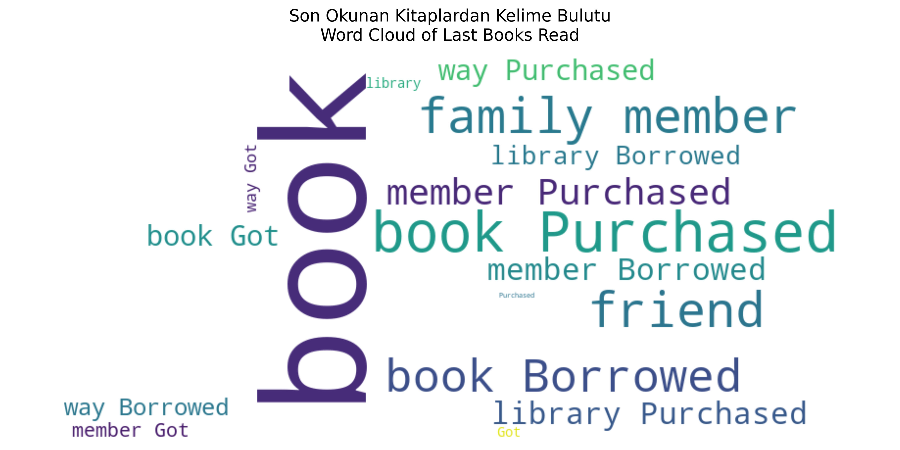

# 📚 Kitap Okuma Alışkanlıkları Analizi | Book Reading Habits Analysis

## 🔍 Proje Hakkında | About the Project

Bu proje, bireylerin kitap okuma alışkanlıklarını yaş, cinsiyet, eğitim, gelir ve medeni durum gibi demografik değişkenler üzerinden analiz etmeyi amaçlamaktadır. Analiz süreci, veri temizleme, keşifsel veri analizi (EDA), görselleştirmeler ve kelime bulutu ile desteklenmiştir.

This project aims to analyze individuals' book reading habits based on demographic variables such as age, gender, education, income, and marital status. The process includes data cleaning, exploratory data analysis (EDA), visualizations, and word cloud generation.

---

## 🧰 Kullanılan Teknolojiler | Technologies Used

- Python (Pandas, Matplotlib, Seaborn)
- Jupyter Notebook
- WordCloud
- VS Code
- Git & GitHub

---

## 📊 Örnek Görselleştirmeler | Sample Visualizations

### 📌 Cinsiyete Göre Yıllık Ortalama Kitap Sayısı  

### 📌 Eğitim Durumuna Göre Kitap Tercihi  

### 📌 Gelir Düzeyine Göre Okuma  

### 📌 Kitap Okumayanların Profili  

---

## 📁 Klasör Yapısı | Project Structure

read-patterns/
├── data/ # Veri seti
├── notebooks/ # Jupyter defterleri
│ ├── 01_data_cleaning_and_eda.ipynb
│ └── 02_exploratory_data_analysis.ipynb
├── chart/ # Grafik görselleri
├── requirements.txt # Bağımlılıklar
├── main.py # Ana python dosyası (isteğe bağlı)
└── README.md # Proje açıklaması
